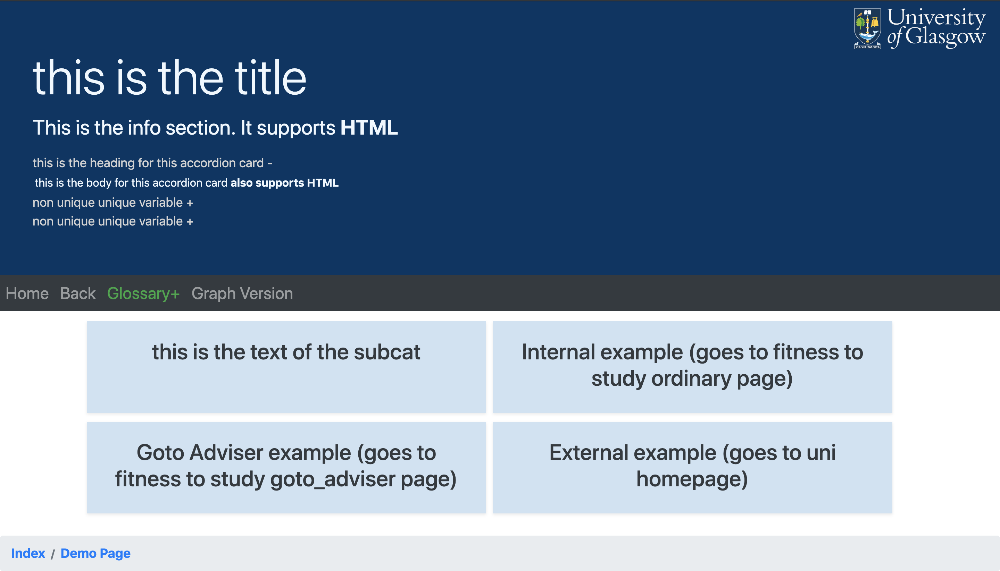

# GuideMe Docs

---

## JSON files

All the data for GuideMe is stored in JSON files that are accessed through jQuery http requests. Data is stored in three separate files described below.

### page_data.json

Used to store all the information relating to pages and their contents. Page names are used as the top level index used to access the data of the corresponding page.

Structure of a given page:

```json
"pagename": {
    "title": (str, required) //title of the page that will be displayed in the browser
    "info": (str, optional) //the main body of information to be displayed to the user. Can use html tags for formatting
    "accordion": (arr[obj], optional)[ //data for accordion elements in the page, an array with each element being an object for an accordion element
        {
            "unique": (str, required) //identifier for the element in the html, required by bootstrap. Follows naming convention c1, c2, ... , cn
            "heading": (str, required) //the title of the element that is displayed, on click will expand further information
            "body": (str, required) //information to be displayed when accordion element is expanded
        }]
    "subcats": (arr[obj], optional)[ //links to different pages in the system
        {
            "name": (str, required) //text that is displayed on the rendered link
            "link": (str, required) //page name that is being linked to, can also be an external hyperlink
            "goto_adviser": (bool, optional) //true if page being linked to is an adviser page. Not present otherwise
            "linkexternal": (bool, optional) //true if page being linked to is an external link. Not present otherwise. Note, cannot have both goto_adviser and linkexternal be true
        }
    ]
}
```

#### Example with Demo Page

Below is an example usage for a page in page_data.json and the corresponding page shown in the browser.

```json
    "demo_page": {
        "title": "this is the title",
        "info": "This is the info section. It supports <b>HTML</b>",
        "accordion":[
            {
                "unique":"this_must_be_unique_and_cant_contain_spaces",
                "heading":"this is the heading for this accordion card",
                "body":"this is the body for this accordion card <b>also supports HTML</b>"
            },
            {
                "unique":"otherwise_this_happens",
                "heading":"non unique unique variable",
                "body":"this is the body for this accordion card <b>also supports HTML</b>"
            },
            {
                "unique":"otherwise_this_happens",
                "heading":"non unique unique variable",
                "body":"this is the body for this accordion card <b>also supports HTML</b>"
            }
        ],
        "subcats":[
            {
                "name":"this is the text of the subcat",
                "link":"this is the link. this is the filename for the page you want to visit e.g. this page has the filename demo_page. when goto_adviser or linkexternal are false they can be omitted",
                "goto_adviser":false,
                "linkexternal":false
            },
            {
                "name":"Internal example (goes to fitness to study ordinary page)",
                "link":"fitness_to_study"
            },
            {
                "name":"Goto Adviser example (goes to fitness to study goto_adviser page)",
                "link":"consider_for_fit_to_study",
                "goto_adviser":true
            },
            {
                "name":"External example (goes to uni homepage)",
                "link": "https://www.gla.ac.uk/",
                "linkexternal": true
            }
        ]
    }
```

Page rendered from JSON


---

### adviser_info.json

Stores information for the adviser pages. It is indexed in the same way as `page_data.json`. The structure is described below:

```json
    "page_name": {
        "title": (str, required) //name of the page being
        "who": (str, required) //the person that the student is being directed to (either SSO or adviser)
        "why": (str, required) //why the student is being directed to that person
        "subcats": (arr[obj], optional)[ //links to different pages in the system
            {
                "name": (str, required) //text that is displayed on the rendered link
                "link": (str, required) //page name that is being linked to, can also be an external hyperlink
                "goto_adviser": (bool, optional) //true if page being linked to is an adviser page. Not present otherwise
                "linkexternal": (bool, optional) //true if page being linked to is an external link. Not present otherwise. Note, cannot have both goto_adviser and linkexternal be true
            }
    }
```

### motm.json

Stores the messages of the month. These are set automatically from the system data.

```json
{
    0: 
}
## Classes

> Note: an underscore before a method name denotes pseudo-privacy, although the methods are publicly accessible they should be treated as private methods and should not be treated as part of the class' public interface.

### **class** Page

> Class for pages being displayed. An instance of page is created on page load and destroyed when a new page is loaded.

#### Attributes

- **name**: (str) Name of the page.
- **template**: (str) Name of the html template used to render the page.
- **data**: (obj) json object containing the page's data, structure varies depending on the datafile that is used. Details on the different datafiles can be found here LINK TO SECTION ON THE DATAFILES

#### Methods

---

##### constructor(name, template, data)

Creates a new Page object with the parameters as described above.

##### **static async getData(name, datafile, callback)**

Opens an asynchronous http get request for the page called "name" from the json datafile, then performs executes the callback with the returned data. Note that the data being returned is only accessible within the callback function.

###### Parameters

- **name**: (str) Name of the page that data is being retrieved for.
- **datafile**: (str) Name of the datafile the request is being made for.
- **callback**: (function) Code that is to be executed when the data is retrieved

###### Example Usage

```js
Page.getData("index", "page_data.json", function(data){
    //DO SOMETHING WITH data
});
```

##### **setupSubcats()**

Private helper function, when page is being rendered takes the subcats for the page and prepends the appropriate URL formatting for the link, such that:

- Normal page: &rarr; "\\?p=" + link
- Go to adviser page: &rarr; "\\?g=" + link
- External link: &rarr; link

##### **setMotm()**

Private helper function, retrieves the "message of the month" from the motm.json and sets assigns it to ```this.data["motm"]```.

##### render()

Takes the page data and passes it to the Moustache rendering engine. Also retrieves the history and renders the breadcrumb trail. Will redirect to a 404 page if ```this.data``` is null or undefined.

---

### **class** History

> Stores the history for the current session, this should be treated as a singleton with a global point of access at ```History.retrieveHistory()```, direct calls to the constructor should be avoided although this is difficult to enforce in Javascript.

#### Attributes

- **full_hist**: (array) Contains the name of every page the user has visited during the session.
- **breadcrumb**: (array) The current path the user has taken form the index page, it does not contain duplicates and is reset every time the user returns to index.

#### Methods

---

##### constructor(hist)

Should be treated as a private constructor, the only place the constructor should be called is within ```History.retrieveHistory()```.

Firstly, the the constructor checks if there is any existing history from the URI (ie it contains h=\* some stuff *\ ) and will return an instance with the existing history. Then if the ```hist``` parameter passed is non-null it will return an instance with the data from that, otherwise it returns a fresh instance with empty arrays for ```full_hist``` and ```breadcrumb```.

###### Parameters

- **hist**: (object) json object stored in ```sessionStorage```, passed from ```History.retrieveHistory()```. It has the structure

```json
{
    "full_hist": [\* items *\],
    "breadcrumb": [\* items *\]
}
```

##### static retrieveHistory()

Global point of access for accessing the history. Retrieves the history from ```sessionStorage```, parses it into a JSON object then returns an instance of History with the data from ```sessionStorage```.

##### _storeHistory()

Private method. Converts the instance into a stringified JSON object and stores it in ```sessionStorage```. This is called every time the history is updated so that every update is persistent across pages.

##### update(page, type=null)

Updates the contents of history then stores in ```sessionStorage```.

In all cases, page is added to the end of `full_hist` provided that it is not the same as the last entry in the array. There is additional complexity when adding elements to the breadcrumb however.

- If the current page is "index" then the breadcrumb is reset to only contain index
- If `type` is `null` then the page is simply added to the breadcrumb provided it doesn't already contain the page
- If `type` is `back` then the last element of the breadcrumb is removed
- If `type` is `breadcrumb` then we set breadcrumb to the sub-array of breadcrumb from "index" the the page that is being added (inclusive)

###### Parameters

- **page**: (str) Name of the page getting added to history
- **type**: (str, default=null) Takes either the value "back" or "breadcrumb" and will determine the correct way to update the breadcrumb.

##### renderBreadcrumb()

Takes the breadcrumb, builds a string with proper html formatting and renders it in the DOM element with ID "breadcrumb". Called in Page.render().

##### getPreviousPage()

Will return the previous page from `full_hist` given that it contains more than one element. If not it will return the 0th element.

---

### **class** Nav

> Nav is a container for several static methods used for navigation along with some helper functions. Its constructor is never intended to be called.

#### Attributes

None

#### Methods

---

##### static redirect(page)

Builds URI for a given page and will redirects to it. Redirects to 404.html if there is an error.

##### static goBack()

Gets previous page from the history, updates it accordingly and redirects. Called by clicking on the back button in the html.

##### static breadcrumbClick(page)

Redirects to the page corresponding to a link on the breadcrumb trail and updates the history accordingly. Called by clicking an link in the breadcrumb element.

###### Parameters

- **page**: (str) Item in the breadcrumb trail that has been clicked on. Passed through the html build in History.renderBreadcrumb().
